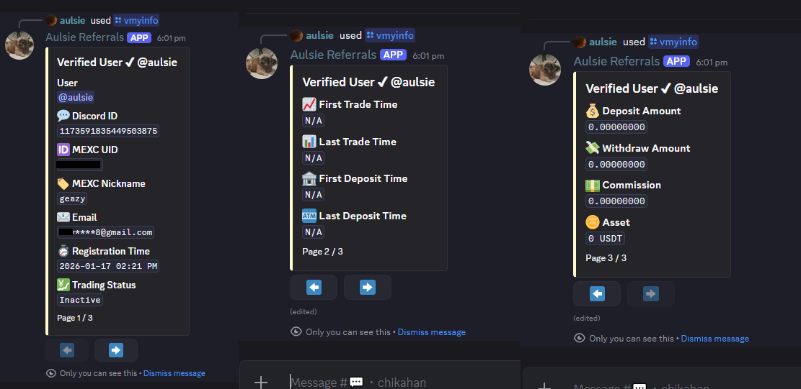

# Discord Verification via MEXC Referral API

This folder contains an overview of the verification bot.
It explains the core flow, integration points, and the MEXC referral API call without exposing the full source.

## What this bot does

- Accepts a Discord user's MEXC UID through a modal form.
- Calls the MEXC affiliate/referral API to verify the UID belongs to the configured referral.
- If the UID is valid, the bot either:
  - auto-approves the verification, or
  - sends a pending review request to staff.
- Approved users receive a verified role in the server.
- The bot also supports staff review, voice interview channels, CSV exports, and admin configuration.

---

## Flow summary

1. A user clicks the verification panel button.
2. A modal prompts the user for their MEXC UID.
3. The bot checks the MEXC referral API for membership.
4. If the UID is not in the referral, verification is blocked.
5. If the UID is found, the bot assigns the verified role.
6. The user receives a DM confirmation once approved.
7. If auto-approve is disabled, the request is sent to staff.
8. Staff can approve, deny, or create a VC for interview.

---

## User experience

- `/verify` opens the MEXC UID modal.
- `/vmyinfo` shows the user's own verification details.
- If auto-approve is off, users submit to the pending channel and wait for staff review.
- If auto-approve is on, valid UIDs are immediately verified.

---

## Staff experience

- Staff review requests in the Pending channel.
- Staff can approve or deny requests with a single click.
- Staff can optionally create a voice channel for interviews.
- Once approved or denied, the temporary interview VC is removed.
- Staff commands include:
  - `/vcheck [user]` — View a user's verification details
  - `/vunverify [user]` — Remove a user's verification
  - `/vreferral [status]` — Show latest 50 verified or unverified referrals

---

## Admin experience

Admins can configure the system and manage channels.
Important commands:

- `/vinfo` — Show verification configuration
- `/vreferral [status]` — Show latest 50 referrals
- `/vreferrals` — Show latest 50 referrals with pagination
- `/vsetmexcapi` — Configure the MEXC API key and secret
- `/vchannel` — Set verification channel
- `/vpanel` — Send verification panel
- `/vpaneledit` — Edit the most recently created panel
- `/vcategory` — Set interview VC category
- `/vsetpending` — Set pending channel
- `/vsetapproved` — Set approved channel
- `/vsetdenied` — Set denied channel
- `/vrole [@role]` — Set verified role
- `/vaddstaff [@role]` — Add staff role
- `/vremovestaff [@role]` — Remove staff role
- `/vcooldown` — Set cooldown
- `/vdeletetoggle` — Toggle auto deletion of non-staff messages in verification channel
- `/vactive` — Configure active trading period

---

## Owner experience

Owner and trusted users can manage API credentials and exports.

- `/vsetmexcapi` — Configure the MEXC API key and secret
- `/vreferral [Status]` — Show verified/unverified referrals
- `/vreferrals` — Show latest 50 referrals with export option
- `/vreferralexport` — Export all MEXC referral data to CSV
- `/vreferralinfo [user]` — View a user's MEXC details
- `/vapprovetoggle` — Toggle automatic approval

---

## Key integration points

### Configuration

The bot reads its runtime settings from `config.json`.
The file contains:

---

- role IDs for staff and verified users
- channel IDs for verification and review flows
- verification cooldown and active trading window
- panel message IDs and trusted user IDs


### MEXC API usage

The bot queries the MEXC referral endpoint:

```text
https://api.mexc.com/api/v3/rebate/affiliate/referral?{query}&signature={signature}
```


### MEXC API Response Keys

The API returns referral data with the following keys (15 keys found):

- asset
- commission
- depositAmount
- email
- firstDepositTime
- firstTradeTime
- identification
- inviteCode
- lastDepositTime
- lastTradeTime
- nickName
- registerTime
- tradingAmount
- uid
- withdrawAmount

## Command summary

### User commands

- `/verify` — Submit your MEXC UID for verification
- `/vmyinfo` — View your own verification details

### Staff commands

- `/vcheck [user]` — View a user's verification details
- `/vunverify [user]` — Remove a user's verification
- `/vreferral [status]` — Show the latest 50 referrals

### Admin commands

- `/vinfo` — Show verification configuration
- `/vreferral [status]` — Show the latest 50 referrals
- `/vchannel` — Set verification channel
- `/vpanel` — Send verification panel
- `/vpaneledit` — Edit the most recently created panel
- `/vcategory` — Set interview VC category
- `/vsetpending` — Set pending channel
- `/vsetapproved` — Set approved channel
- `/vsetdenied` — Set denied channel
- `/vrole [@role]` — Set verified role
- `/vaddstaff [@role]` — Add staff role
- `/vremovestaff [@role]` — Remove staff role
- `/vcooldown` — Set cooldown
- `/vdeletetoggle` — Toggle auto deletion
- `/vactive` — Configure active trading period

### Owner commands

- `/vsetmexcapi` — Configure the MEXC API key and secret
- `/vreferral [Status]` — Show the latest 50 referrals
- `/vreferrals` — Show the latest 50 referrals with pagination
- `/vreferralexport` — Export all MEXC referral data to CSV
- `/vreferralinfo [user]` — View a user's MEXC details
- `/vapprovetoggle` — Toggle auto approval

## Usage notes

- This repo is a public showcase of a Discord verification via MEXC Referral.
- What is shared here is enough to understand the API integration, configuration, and bot behavior.
- Minor bugs may exist – feel free to modify and improve it.

---

# Screenshot Gallery

##Below are placeholder screenshot files for the verification workflow. Update these image files in `showcase/images/` with your real screenshots.

### Verification Panel
Main verification panel where users can start the MEXC referral verification process.


### UID Input Modal
Modal where users enter their MEXC UID for verification.


### Invalid UID Result
Shown when the entered UID is not found under the configured referral list.


### Successful Verification
User UID was found in the referral system and the verified role was assigned successfully.


### Approved User DM
Direct message automatically sent to users after being verified.


### Referral Approved Confirmation
Confirmation message shown after the referral verification is approved.


### Pending Review Notice
Displayed when auto-approve is disabled and the request is sent for manual staff review.


### Review Action Controls
Buttons and controls available for staff handling pending verification requests.


# Staff Features

### Approved Logs Channel
Message sent to the approved logs channel after successful verification.


### Verified Referral List
Display of `/vreferral verified` command showing verified referrals.


### User Verification Check
Result of `/vcheck [user]` command displaying a user's verification status.


# Admin Features

### Admin Commands Overview
Overview of available administrator commands.


### Unauthorized CSV Export Attempt
Error shown when an unauthorized admin attempts to export CSV data.


# Owner Features

### Instant CSV Export
Instant export feature available only to the owner or trusted users.


### MEXC API Setup - Page 1
First page of the `/vsetmexcapi` setup interface.


### MEXC API Setup - Page 2
Second page of the `/vsetmexcapi` setup interface.


### MEXC API Setup Modal
Modal used to input API credentials and configuration.


### MEXC API Setup - Page 3
Final page of the `/vsetmexcapi` setup process.


# Manual Review System

### Staff Review Channels
Dedicated channels used by staff for handling verification reviews.


### Verification Sent for Review
Verification request being forwarded to the review queue.


# Pending Review Actions

### Verify or Deny Request
Staff members can approve or deny verification requests directly from the pending review message.


### Create Interview VC
Option to create a temporary voice channel for interviewing the applicant.


### Applicant DM Notifications
DM notifications sent to the applicant regarding interview VC actions.


# Verified User Features

### User Verification Information
Verified users can view their linked MEXC account information using `/vmyinfo`.


