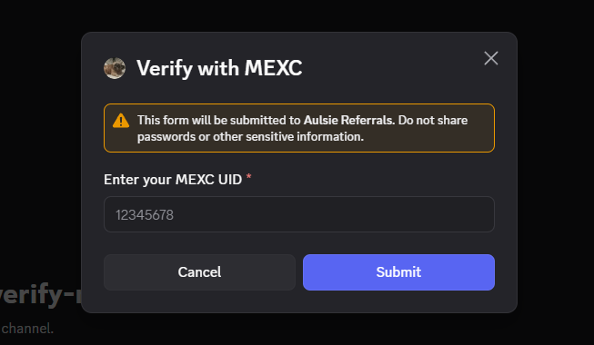
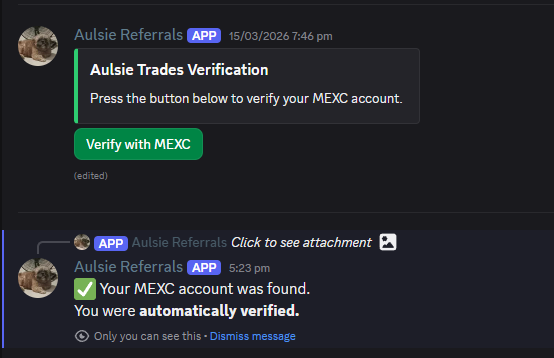
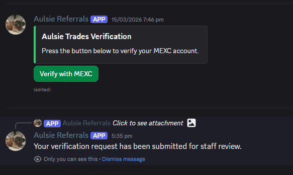
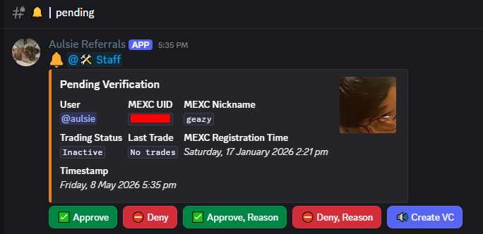
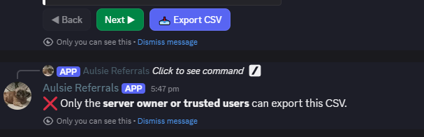
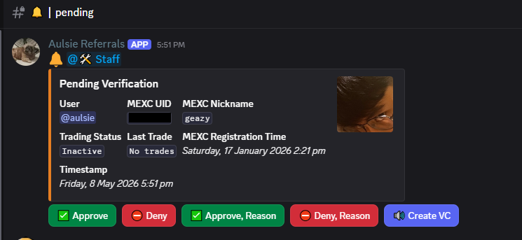
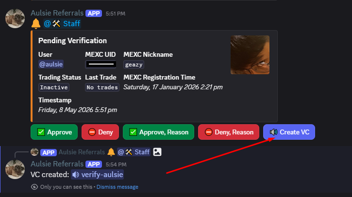

# Discord Verification via MEXC Referral API

This folder contains an overview of the verification bot.
It explains the core flow, integration points, and the MEXC referral API call without exposing the full source.

## What this bot does

- Accepts a Discord user's MEXC UID through a modal form.
- Calls the MEXC affiliate/referral API to verify the UID belongs to the configured referral.
- If the UID is valid, the bot either:
  - auto-approves the verification, or
  - sends a pending review request to staff.
- Approved users receive a verified role in the server.
- The bot also supports staff review, voice interview channels, CSV exports, and admin configuration.

---

## Screenshot Gallery

Below are placeholder screenshot files for the verification workflow. Update these image files in `showcase/images/` with your real screenshots.

### User screenshots

- 
  1. MEXC referral verification panel
- 
  2. Modal where users input their MEXC UID
- 
  3. You cannot be verified if the UID you entered is not in the referral
- 
  4. MEXC UID was found in the referral and assigned verified role
- 
  5. DM sent to the user who got approved
- 
  6. Referral approved confirmation
- 
  7. Sent for staff review if auto-approve is disabled
- 
  8. Staff review controls available in the pending message

### Staff screenshots

- 
  9. Sent to approved channel
- 
  10. `/vreferral verified` display
- ![11. `/vcheck [user]` result](images/11-vcheck-user.png)
  11. `/vcheck [user]`

### Admin screenshots

- 
  12. Admin commands overview
- 
  13. Admin cannot export CSV when unauthorized

### Owner screenshots

- 
  14. Insta export available to owner/trusted users
- 
  15. `/vsetmexcapi` page 1
- 
  16. `/vsetmexcapi` page 2
- 
  17. `/vsetmexcapi` modal
- 
  18. `/vsetmexcapi` page 3

### Auto-approve disabled flow

- 
  19. Channels for staff reviews
- 
  20. Sent for staff review

### Pending review actions

- 
  21. In pending channel, staff can decide whether to verify or deny
- 
  22. Create VC to interview the applicant
- 
  23. Interview VC disappears once approved or denied

---

## Flow summary

1. A user clicks the verification panel button.
2. A modal prompts the user for their MEXC UID.
3. The bot checks the MEXC referral API for membership.
4. If the UID is not in the referral, verification is blocked.
5. If the UID is found, the bot assigns the verified role.
6. The user receives a DM confirmation once approved.
7. If auto-approve is disabled, the request is sent to staff.
8. Staff can approve, deny, or create a VC for interview.

---

## User experience

- `/verify` opens the MEXC UID modal.
- `/vmyinfo` shows the user's own verification details.
- If auto-approve is off, users submit to the pending channel and wait for staff review.
- If auto-approve is on, valid UIDs are immediately verified.

---

## Staff experience

- Staff review requests in the Pending channel.
- Staff can approve or deny requests with a single click.
- Staff can optionally create a voice channel for interviews.
- Once approved or denied, the temporary interview VC is removed.
- Staff commands include:
  - `/vcheck [user]` — View a user's verification details
  - `/vunverify [user]` — Remove a user's verification
  - `/vreferral [status]` — Show latest 50 verified or unverified referrals

---

## Admin experience

Admins can configure the system and manage channels.
Important commands:

- `/vinfo` — Show verification configuration
- `/vreferral [status]` — Show latest 50 referrals
- `/vreferrals` — Show latest 50 referrals with pagination
- `/vsetmexcapi` — Configure the MEXC API key and secret
- `/vchannel` — Set verification channel
- `/vpanel` — Send verification panel
- `/vpaneledit` — Edit the most recently created panel
- `/vcategory` — Set interview VC category
- `/vsetpending` — Set pending channel
- `/vsetapproved` — Set approved channel
- `/vsetdenied` — Set denied channel
- `/vrole [@role]` — Set verified role
- `/vaddstaff [@role]` — Add staff role
- `/vremovestaff [@role]` — Remove staff role
- `/vcooldown` — Set cooldown
- `/vdeletetoggle` — Toggle auto deletion of non-staff messages in verification channel
- `/vactive` — Configure active trading period

---

## Owner experience

Owner and trusted users can manage API credentials and exports.

- `/vsetmexcapi` — Configure the MEXC API key and secret
- `/vreferral [Status]` — Show verified/unverified referrals
- `/vreferrals` — Show latest 50 referrals with export option
- `/vreferralexport` — Export all MEXC referral data to CSV
- `/vreferralinfo [user]` — View a user's MEXC details
- `/vapprovetoggle` — Toggle automatic approval

---

## Key integration points

### Configuration

The bot reads its runtime settings from `config.json`.
The file contains:

---

- role IDs for staff and verified users
- channel IDs for verification and review flows
- verification cooldown and active trading window
- panel message IDs and trusted user IDs


### MEXC API usage

The bot queries the MEXC referral endpoint:

```text
https://api.mexc.com/api/v3/rebate/affiliate/referral?{query}&signature={signature}
```


### MEXC API Response Keys

The API returns referral data with the following keys (15 keys found):

- asset
- commission
- depositAmount
- email
- firstDepositTime
- firstTradeTime
- identification
- inviteCode
- lastDepositTime
- lastTradeTime
- nickName
- registerTime
- tradingAmount
- uid
- withdrawAmount

## Command summary

### User commands

- `/verify` — Submit your MEXC UID for verification
- `/vmyinfo` — View your own verification details

### Staff commands

- `/vcheck [user]` — View a user's verification details
- `/vunverify [user]` — Remove a user's verification
- `/vreferral [status]` — Show the latest 50 referrals

### Admin commands

- `/vinfo` — Show verification configuration
- `/vreferral [status]` — Show the latest 50 referrals
- `/vchannel` — Set verification channel
- `/vpanel` — Send verification panel
- `/vpaneledit` — Edit the most recently created panel
- `/vcategory` — Set interview VC category
- `/vsetpending` — Set pending channel
- `/vsetapproved` — Set approved channel
- `/vsetdenied` — Set denied channel
- `/vrole [@role]` — Set verified role
- `/vaddstaff [@role]` — Add staff role
- `/vremovestaff [@role]` — Remove staff role
- `/vcooldown` — Set cooldown
- `/vdeletetoggle` — Toggle auto deletion
- `/vactive` — Configure active trading period

### Owner commands

- `/vsetmexcapi` — Configure the MEXC API key and secret
- `/vreferral [Status]` — Show the latest 50 referrals
- `/vreferrals` — Show the latest 50 referrals with pagination
- `/vreferralexport` — Export all MEXC referral data to CSV
- `/vreferralinfo [user]` — View a user's MEXC details
- `/vapprovetoggle` — Toggle auto approval

## Usage notes

- This repo is a public showcase of a Discord verification via MEXC Referral.
- What is shared here is enough to understand the API integration, configuration, and bot behavior.

